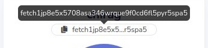

To transfer funds to your account on the Fetch wallet:

In the wallet or application you are using to send the funds, use your account's address as the destination account to which the funds must go.

### To copy your account's address

1. Ensure you are logged into the wallet.
2. Either click on the account address at the top of the dashboard (under the account name):

3. Or select **Deposit** and scan the QR code.

Once you send the tokens, the balance should be updated.

!!! failure
    If your origin wallet says that the address (which should start with "`fetch`") is invalid, it is probably expecting an Ethereum address (beginning with "`0x`") and is most likely trying to send ERC20 FET. In this case, you need to use the [token bridge](https://token-bridge.fetch.ai/) to swap your ERC20 FET for native FET.

!!! warning
    You should **not** send ERC20 FET to this wallet. If you do, you will lose your tokens. The Fetch wallet can only hold native FET tokens and not ERC20 FET tokens.