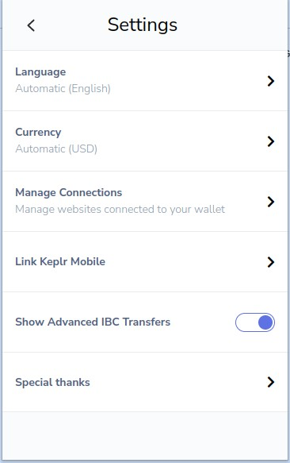
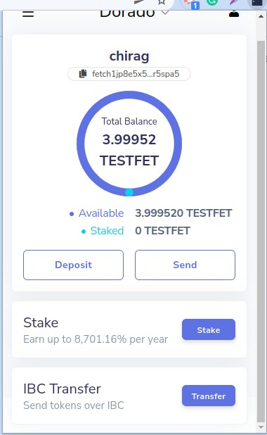
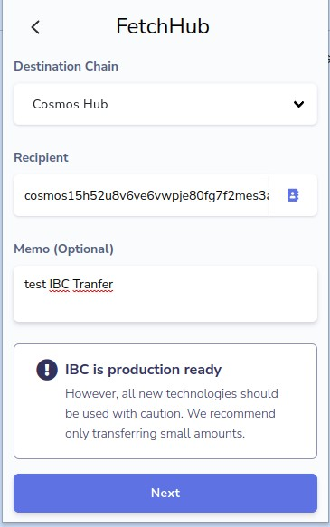
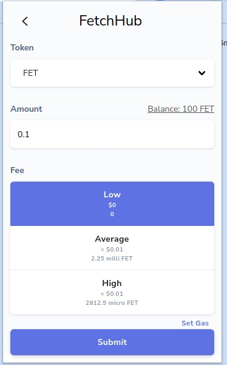
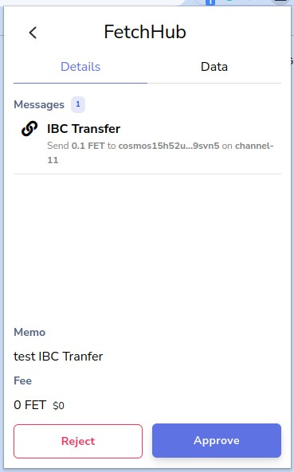
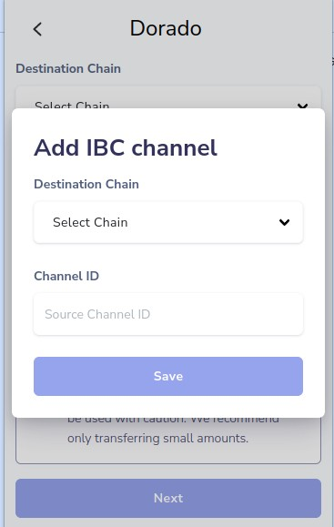

(how to use medium article)

## Native network transfer

From the dashboard, click on the "Send".
Enter the recipient address.
Select the type of token to send.
Enter an amount to send.
Click the "Send" button.
Click the "Approve" button.

## IBC transfer

_NOTE: In order to send IBC transactions, the "Show Advanced IBC Transfers" setting must be toggled on.
To navigate to the settings page from the dashboard, click on the hamburger menu (top-left).
Then click on "Settings"._

Ensure that the desired origin network is selected on the dashboard (top-center).
If the origin network supports IBC, an "IBC Transfer" section will be visible towards the bottom of the dashboard.

Click the "Transfer" button in the "IBC Transfer" section.

Enter your mainnet destination chain address in the Recipient field, a MEMO (Optional), and click on Next to proceed.

Now enter the number of token you’d like to send to destination chain on the Amount field, select the preferred transaction fee then click Submit.
I suggest using Average or High fees at this time.

On the transaction confirmation page, you can review the details of your transaction. Click on [Approve] to confirm.

### ⚛️ Congratulations & Welcome to the IBC Gang! ⚛️

✏ Notes:

- All IBC Hubs have their own channel ID and knowing this channel ID is necessary to perform the IBC transaction.

- Don’t send tokens via [Interchain Transfer] directly to a CEX: this can cause in most cases the loss of the funds.

## First-time origin/destination transfer

Before transferring between any given origin and destination combination for the first time, IBC channels must be configured in the wallet.

Click the "Select Chain" drop-down.
Click "+ New IBC Transfer Channel".

Select the **destination** chain and enter the **source** channel ID (e.g. "channel-100").
Click "Save".

✏ Notes:

- If you write the wrong number on the Destination Chain Channel ID, extension will reject the operation with the warning "Failed to fetch the channel".

- Remember that you must write the channel ID in lower case (i.e. channel-X)
