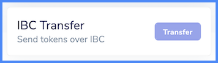

On this page, you can find instructions on how to send tokens using [native transfers](#native-network-transfer) and the [Inter-Blockchain Communication (IBC)](#ibc-transfer) protocol.

## Native network transfer

1. Ensure you are logged into the wallet.
2. Select **Send**.
3. Fill in the details of your transaction:
    * **Recipient**: the address you want to send the tokens to
    * **Token**: the token denomination or type
    * **Amount**: the number of tokens you want to send with this transaction (you can see your current balance above the **Amount**)
    * **Memo (Optional)**: some transactions (e.g. to/from some exchanges) require a specific memo. If not needed, you can leave it blank.
    * **Fee**: the transaction fee. Choose from **Low**, **Average** and **High**
    !!! tip
        Usually, the lower the transaction fee, the longer you need to wait for your transaction to be settled on the network.
4. Press **Send**.
5. In the summary screen, review the details and if everything is correct, select **Approve**.

!!! info
    You can check the status of your transaction via [the explorer](https://explore-fetchhub.fetch.ai).

## IBC transfer

1. Ensure you are logged into the wallet.
2. Make sure IBC transfers are enabled and that your selected network supports it.

    !!! tip
        To enable IBC transfers in the wallet:

        From dashboard, click the  icon in the top left, then **Settings**. Toggle the **Show Advanced IBC Transfers** switch on.
  
           

    !!! warning "Note"
        If your selected network does not support IBC transfers, you will not see an **IBC Transfer** section in the dashboard.

3. Click the **Transfer** button in the **IBC Transfer** section.

    

4. Fill in the details of your transaction:
    * **Destination Chain**: the destination blockchain.

        !!! info
            If you do not see your desired chain, you need to [set up IBC channels first](#first-time-origindestination-transfer).

    * **Recipient**: the address you want to send the tokens to
    * **Memo (Optional)**: an optional memo.

5. Press **Next**.
6. In the next page, provide the following:
    * **Token**: the denomination or type of the tokens being sent
    * **Amount**: the number of tokens to be sent
    * **Fee**: the transaction fee. Choose from **Low**, **Average**, **High**.
7. Hit **Submit**.
8. The wallet now shows you a summary of the transaction. Review it and if you are happy, hit **Approve** to complete the transfer.

!!! warning
    Don’t send tokens via [Interchain Transfer] directly to a CEX. In most cases, this can cause loss of your funds.

### First-time origin/destination transfer

All IBC Hubs have their own channel ID and knowing this channel ID is necessary to perform the IBC transaction.

Before being able to make an IBC transfer between any two chains for the first time, an IBC channel must be configured in the wallet:

1. Follow the instructions for [making an IBC transfer](#ibc-transfer), up to [Step 4](#step4).
2. Click the **Select Chain** drop-down.
3. Select **+ New IBC Transfer Channel**.
4. Select the **Destination Chain** and enter the source **Channel ID** (e.g. `channel-100`).

    !!! tip To find out the IBC channel ID between any two chains:
        1. Go to the [IBC Relayers](https://www.mintscan.io/fetchai/relayers) section of the chain.
        2. To find the right channel ID (which must be written in lower case channel-[number]) you just have to click on the chain to which you want to send your tokens and look for the channel indicated in green:
            - the number of the channel ID will be the one on the left! For example, the channel-id to send from Fetch.AI to Osmosis is channel-10
        3. Enter `channel-X` as the Destination Chain in the Fetch wallet (`channel-10` in our example).

    !!! warning
            If there are no green channels please wait because there is a risk that the relays that connect your starting chain with that zone are temporarily inactive.

    !!! info
        Remember to write the channel ID in lower case (i.e. `channel-X`)

5. Click **Save**.

!!! Failure
    If you input the wrong Channel ID, the wallet will not accept it and shows you an error.
